# 최석민 포트폴리오
> 올바름을 추구하는 것을 가장 큰 가치로 여기고 있습니다.

 

## :pushpin: Intro

- 이름 : 최석민
- 최종학력 : 건국대학교 응용통계학과
- 군필여부 : 필(의경복무)
- 취미: 달리기,기타,자전거,드라이브
 

## :pushpin: Contact
- 이메일: seogseog28@gmail.com
- 깃헙: https://github.com/seogseog

 

## :pushpin: Projects
### 1. [SPSS와 R을 이용해 새로운 문화트렌드 타투에 대해 사회조사]
> SPSS와 R을 이용해 새로운 문화트렌드 타투에 대해 사회조사  (팀 프로젝트)  
> 
>  
>기술 스택:  
>R / SPSS / Powerpoint   
>  

<b>프로젝트 상세설명 펼치기</b>

  ## 1. 제작 기간 & 참여 인원
  - 2017년 11월 18일 ~ 12월 20일
  - 5명 팀 프로젝트

  ## 2. 프로젝트기획
  - 타투에 대한 인식변화와 타투 의향에 영향을 미치는 독립변수가 어떤 것이 있는지를 알아보았습니다.
  ## 3. 연구 가설
 1. 일반적 특성에 따른 타투의 관심도 및 경험도, 친밀도, 외모만족도, 유행추종도, 타투시술 의향의 차이를 확인한다

 2. 타투 시술의향에 영향을 미치는 요인을 파악한다.

 3. 타투를 할 의향에 따라 가족 또는 친구의 타투 동의여부에 차이가 있는지를 파악한다. 
  
  ## 4. 분석 결과
 ### 1. 빈도분석의 결과는 다음과 같습니다.
   1. 타투를 한 사람들이 한 타투의 종류에 대한 빈도분석입니다.
     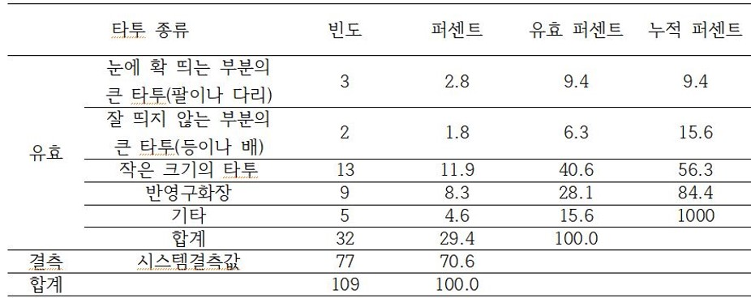
   2. 타투 의향이 있는 사람들이 타투를 하고 싶은 이유에 대한 빈도 분석입니다.
     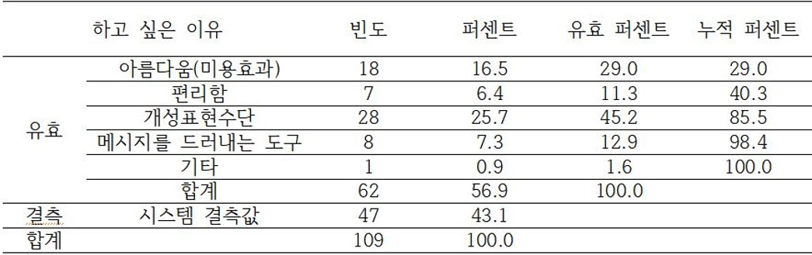
   3. 타투 의향이 없는 사람들이 하고 싶지 않은 이유에 대한 빈도 분석입니다.
     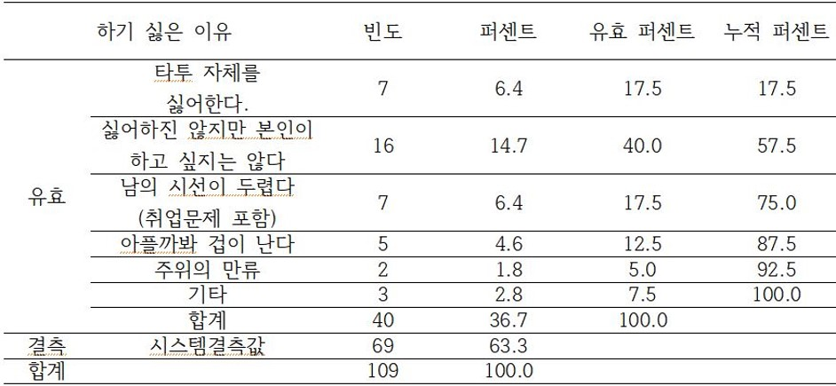
 

 ### 2. 다음은 의향의 차이를 분석한 결과입니다.
   1. 성별에 따른 의향 차이입니다. 성별에 따른 유의한 차이를 보이는 변수는 유행추종도(p<0.05)로 나타났습니다. 여자가 남자보다 높게 나타났습니다.
     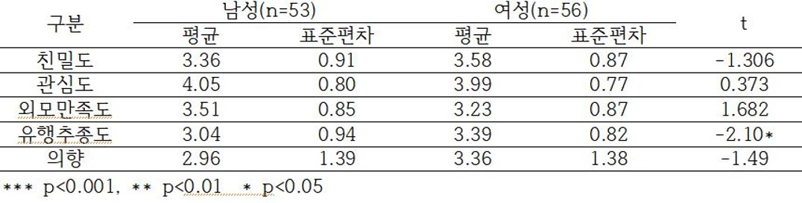
   2. 전공에 따른 의향 차이입니다. 전공에 따른 유의한 차이를 보이는 변수는 타투의향으로 나타났습니다. Duncan 사후분석을 한 결과, 전공계열에 따른 타투의향은 인문사회계열이 자연계열보다 높게 나타났습니다.
     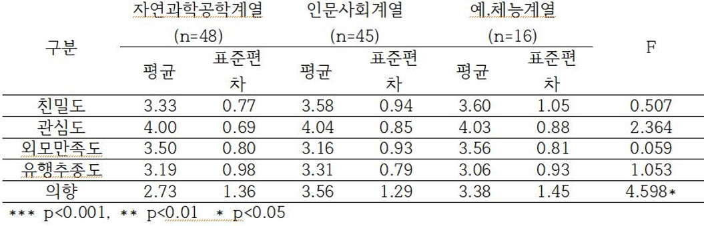
   3. 성격에 따른 의향 차이입니다. 성격에 따른 유의한 차이를 보이는 변수는 유행추종도로 나타났습니다. 외향적인 성격이 내향적인 성격보다 높게 나타났습니다.
     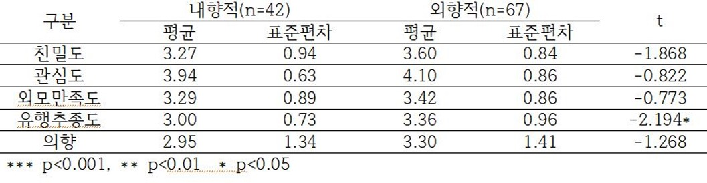
 ### 3. 다음은 상관 분석입니다. 
     - 관심도와 친밀도, 관심도와 유행추종도, 친밀도와 유행추종도는 약한 양의 상관관계가 있습니다. 친밀도와 외모만족도는 약한 음의 상관관계가 있습니다.
   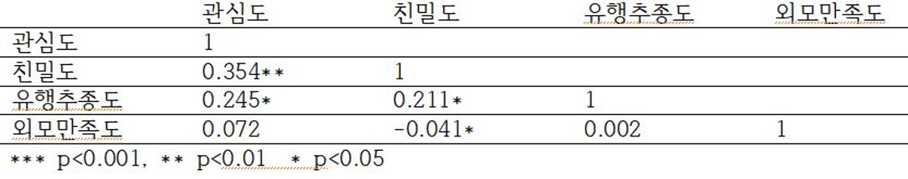
 ### 4. 다음은 회귀 분석입니다. 
   - 저희는 종속변수를 타투를 할 의향으로, 독립변수를 유행추종도, 관심도 및 경험도, 친밀도, 외모만족도, 전공계열(범주형)을 사용하였습니다.                      
       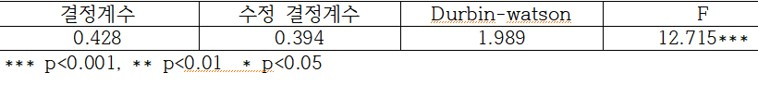
   - 수정된 결정계수가 0.394 이므로 독립변수는 종속변수를 약 39%를 설명해줍니다.
   - Durbin-Watson값이 1.989로, 1과 3사이의 값이므로 잔차의 독립성은 문제가 없습니다.
   - 분산분석에서 유의확률이 0.000 이므로 이 회귀모형은 적합합니다.
   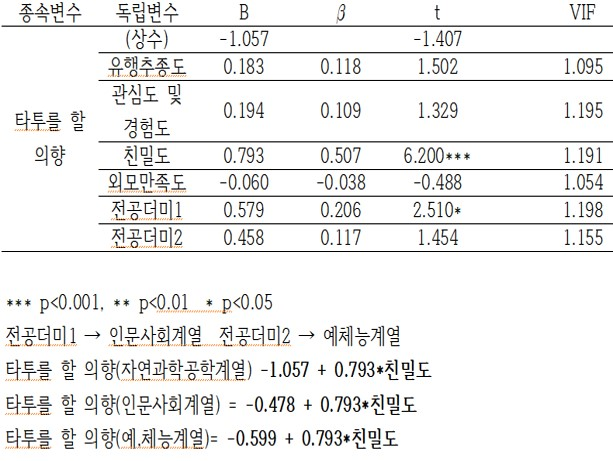
   - 친밀도의 유의확률이 0.000이므로 매우 유의하여, 친밀도는 타투를 할 의향에 유의한 영향을 미칩니다.
   - 유행추종도, 관심도 및 경험도, 외모만족도는 유의하지 못합니다.
   - 인문사회계열, 예체능계열, 자연과학공학계열 순으로 타투를 할 의향이 높습니다.                        
   ## 5. 결론
  - 유행 추종도에 영향을 주는 요인은 성별과 성격이 있습니다.
  - 타투의향에 영향을 주는 요인은 전공계열이 있습니다.
  - 관심도와 친밀도, 관심도와 유행추종도, 친밀도와 유행추종도는 약한 양의 상관관계를 보이고 친밀도와 외모 만족도는 약한 음의 상관관계를 보입니다.
   ## 6. 한계
   - 직접 설문지를 작성하고 배포한 것을 토대로 분석하여 표본의 수가 부족합니다. 따라서 신뢰도가 약하다고 사료될 수 있습니다.
   ##7. 부록
   - 직접 작성한 설문지 원본을 자료 보고서에 첨부하였습니다. images 폴더  8조사조론보고서.hwp 를 통해서 확인하실 수 있습니다.

 

  
  ### 2. [오늘의 지하철은](https://github.com/kohyj006/kode)
> 웹 개발 프로젝트(팀 프로젝트)  
> 
>  
>기술 스택:  
>Python 3.9.5 / Pycharm / django 3.2.4 / HTML5 / Javascript 1.7 / CSS /BootStrap 4
> / MySQL / AWS /  
>  

<b>프로젝트 상세설명 펼치기</b>

  
 ## 1. 제작 기간 & 참여 인원
- 2021년 8월 9일 ~ 8월 20일
- 4명 팀 프로젝트

 ## 2. 프로젝트기획
 
 
 ## 3. 요구사항 정의서
 
 
  
 ## 4. 요구사항 실현
 
 - main 페이지는 다음과 같습니다. Home 버튼을 활성화 하였고, TrafficInfo, Board, Contact, Link 페이지를 만들었고, Link 페이지를 클릭할 시 서울 지하철 홈페이지로 이동하도록 하였습니다.
 
  - 로그인 페이지는 facebook과 twitter 부분을 네이버 api를 활용하여 네이버와 연동하여 로그인할 수 있도록 하였습니다.
 
  - Board페이지에서는 관리자가 지하철 뉴스나 지하철 관련 정보를 올려서 이용자들이 확인할 수 있도록 설계하였습니다.
 
  - contact 페이지에서는 저희의 정보와 연락망을 기록하였습니다.
  
  ## 5. 한계
  - 회원가입을 하고 로그인을 하는 과정은 무리없이 진행되었지만 User 계정으로는 게시판에 글을 작성하도록 구현을 하지 못하였습니다.
  - 지하철 데이터를 시각화하고 싶었지만, Pycharm 환경에서는 pandas가 지원이 되지않아 원하는 시각화를 할 수 없었고, 단지 데이터를 보여주는 것에만 그쳤습니다.
  - Board에서 User들이 서로 댓글을 달면서 소통할 수 있는 공간을 만들고 싶었지만 만들지 못했습니다.
  

 

---

### 3. [스마트 쉘터 위치 우선순위 시각화]
>정부의 신사업인 스마트 쉘터에 대해 먼저 세워져야 할 곳 우선순위 4곳을 시각화하였습니다.(개인 프로젝트)  

>  
>기술 스택:  
>Python / Jupiter Notebook / Pandas / folium / Web Crawling  
>matplotlib / Tableau   
>  

<b>프로젝트 상세설명 펼치기</b>

 
 ## 1. 제작 기간 & 참여 인원
  - 2021년 9월 23일 ~ 9월 25일
  - 개인 프로젝트

  ## 2. 프로젝트기획
  - 정부의 스마트 시티 계획에 따른 스마트 쉘터 도입 시 버스 정류장별 승*하차 승객수, 미세먼지, 평균 기온에 따라 우선순위를 분석하여 먼저 설치되어야 할 곳 네 군데를 찾았습니다.
  ## 3. 분석 개요
- 버스 정류소 위치정보와 정류장, 시간대별 승하차 인원수를 버스 ARS-ID를 기준으로 inner merge 하였고 데이터 전처리하였습니다. 스마트 쉘터에 대한 인식을 조사하기 위해 유튜브, 인스타그램, 네이버 api를 활용해 비정형데이터들을 크롤링하여 형태소 분석, SNA, 긍정어와 부정어를 분석하였고 워드 클라우드로 시각화하였습니다. tableau와 folium을 이용하여 전처리 된 데이터를 지도에 나타내었고 승하차 인원수는 버블플롯으로 미세먼지는 카토그램으로 시각화하여 먼저 세워져야 할 곳 우선순위 4곳을 표시하였습니다.
  
  ## 4. 데이터
            a. 데이터 수집기간 : 2020.09~ 2021.08
            b. 데이터 수집 채널 : 서울 열린 데이터 광장, 네이버 블로그, 뉴스, 카페, 인스타그램
            c. 분석 대상 : 승하차 인원수에 따른 교통량, 스마트 쉘터 후기 분석, 버스 이용객 니즈 분석
            d. 사용한 데이터 : 
               - 공공데이터
                ㄱ. 서울특별시 버스정류소 위치정보
                ㄴ. 서울시 버스노선별 정류장별 시간대별 승하차 인원정보
                ㄷ. 서울시 기간별 일평균 대기환경 정보
               - 소셜데이터
                ㄱ. 트위터
                ㄴ. 블로그
                ㄷ. 뉴스
                ㄹ. 인스타그램
 ## 5. 분석 과정
   1. 긍정어 부정어 분석
 
 
        
 - 대표적인 긍정어 : 편리하다, 보완하다, 쾌적하다
        
 - 대표적인 부정어 : 불편하다, 혼잡하다, 찜찜하다
         
 2. 연관어 분석과 SNA
 
 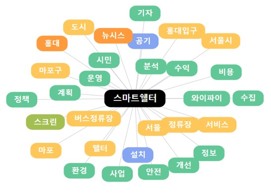
  
 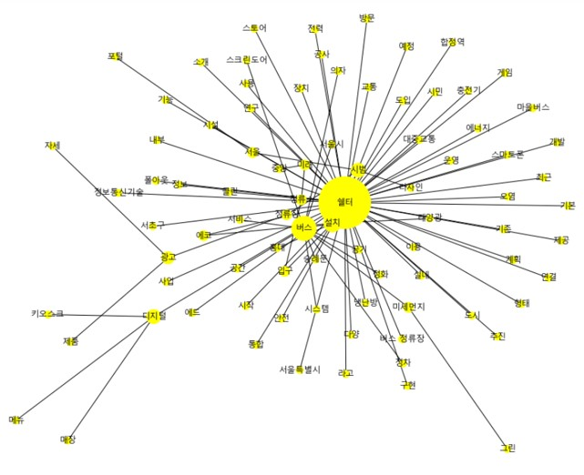
 
 3. 워드클라우드
 
 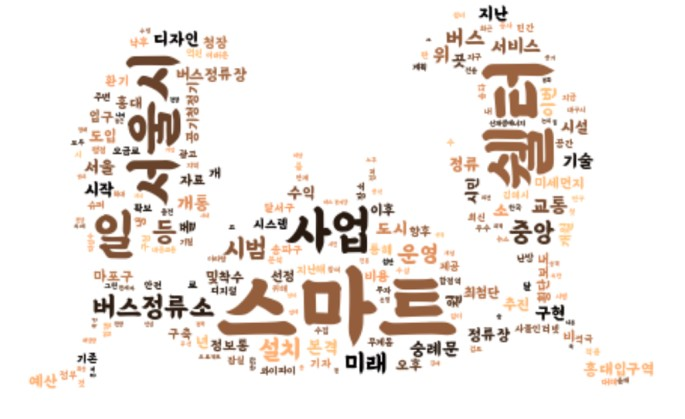
    
 - 네이버 api 코드를 이용해 네이버 카페, 블로그, 뉴스를 크롤링하여 워드클라우드를 표현하였습니다.
   
 - 아직 시민들에게 익숙하지 않은 분야라서 인스타그램과 유튜브에서는 양질의 정보를 얻지 못하였습니다.
 
 4. 데이터 전처리
  
 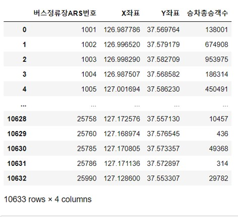
   
 - 버스 정류장 위치정보 데이터를 가져와 버스정류장 ARS-ID와 좌표값만 가지고 데이터 프레임을 만들었습니다.
    
 - 작년 9월부터 올해 8월까지의 버스 정류장별 승하차인원수 데이터를 가져와서 ARS-ID를 기준으로 Inner merge하여 새로운 데이터프레임을 만들고 승하차인원수가 높은 순으로 재정렬하였습니다.
 
 
 5. folium을 이용해 지도에 시각화
    
 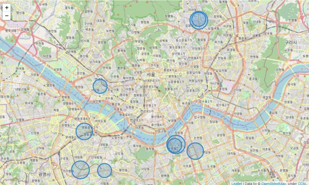
   
 - 앞서 만든 데이터를 지도에 시각화하였고, 미세먼지 데이터를 불러와 같은 화면에 나타내었습니다.
    
 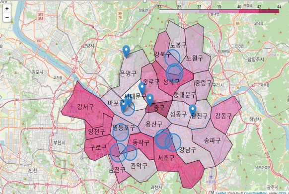
    
 - 미세먼지와 승하차 인원수에 따라 가장 먼저 스마트 쉘터가 지어져야 할 곳을 표현하였습니다.
 
 
 ## 6. 결론
   - 고속터미널 역, 구로디지털단지역 환승센터, 수유역, 미아사거리 역 순으로 우선순위를 보입니다.
 ## 7. 한계
  - 스마트 쉘터 사업이 최근에 시작되어 양질의 데이터를 얻기 힘들었습니다.
  - 통계적인 분석을 통해 중요도를 나누지 못하였습니다. 이 후 통계분석까지 포함해서 보완할 예정입니다.
 
 
 
  

 
