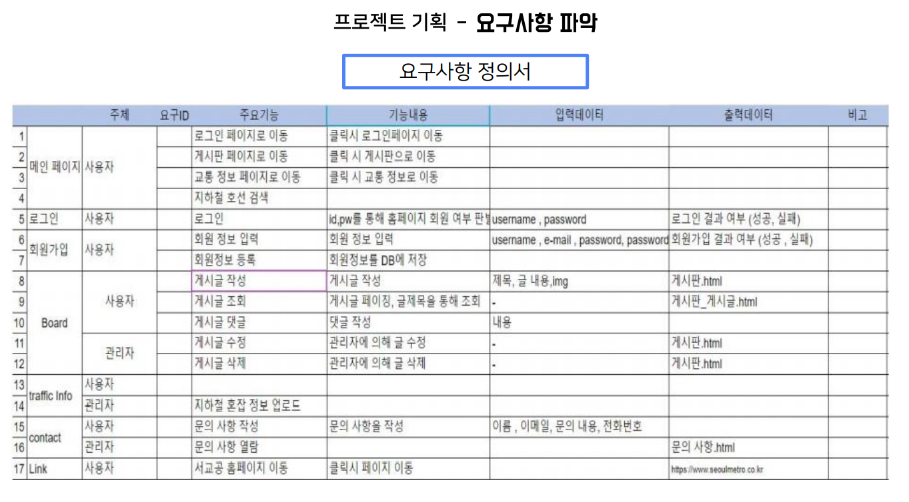

# 최석민 포트폴리오
> 올바름을 추구하는 것을 가장 큰 가치로 여기고 있습니다.

 

## :pushpin: Intro
 
- 이름 : 최석민
- 최종학력 : 건국대학교 응용통계학과
- 군필여부 : 필(의경복무)
- 취미: 달리기,기타,자전거,드라이브
 

## :pushpin: Contact
- 이메일: seogseog28@gmail.com
- 깃헙: https://github.com/seogseog

 

## :pushpin: Projects
### 1. [SPSS와 R을 이용해 새로운 문화트렌드 타투에 대해 사회조사]
> SPSS와 R을 이용해 새로운 문화트렌드 타투에 대해 사회조사  (팀 프로젝트)  
>개발 기간: 2017.11.18 ~ 2017.12.20  
>  
>기술 스택:  
>R / SPSS / Powerpoint   
>  

<b>프로젝트 상세설명 펼치기</b>

  ## 1. 제작 기간 & 참여 인원
- 2019년 2월 18일 ~ 4월 5일
- 5명 팀 프로젝트

 

  
  ### 2. [오늘의 지하철은](https://github.com/kohyj006/kode)
> 웹 개발 프로젝트(팀 프로젝트)  
>개발 기간: 2021.8.9 ~ 2021.8.20  
>  
>기술 스택:  
>Python 3.9.5 / Pycharm / django 3.2.4 / HTML5 / Javascript 1.7 / CSS /BootStrap 4
> / MySQL / AWS /  
>  

<b>프로젝트 상세설명 펼치기</b>

  
 ## 1. 제작 기간 & 참여 인원
- 2021년 8월 9일 ~ 8월 20일
- 4명 팀 프로젝트

 ## 2. 프로젝트기획
 
 
 ## 3. 요구사항 정의서
 
 
  
 ## 4. 요구사항 실현
 
 - main 페이지는 다음과 같습니다. Home 버튼을 활성화 하였고, TrafficInfo, Board, Contact, Link 페이지를 만들었고, Link 페이지를 클릭할 시 서울 지하철 홈페이지로 이동하도록 하였습니다.
 
  - 로그인 페이지는 facebook과 twitter 부분을 네이버 api를 활용하여 네이버와 연동하여 로그인할 수 있도록 하였습니다.
 
  - Board페이지에서는 관리자가 지하철 뉴스나 지하철 관련 정보를 올려서 이용자들이 확인할 수 있도록 설계하였습니다.
 
  - contact 페이지에서는 저희의 정보와 연락망을 기록하였습니다.
  
  ## 5. 한계
  - 회원가입을 하고 로그인을 하는 과정은 무리없이 진행되었지만 User 계정으로는 게시판에 글을 작성하도록 구현을 하지 못하였습니다.
  - 지하철 데이터를 시각화하고 싶었지만, Pycharm 환경에서는 pandas가 지원이 되지않아 원하는 시각화를 할 수 없었고, 단지 데이터를 보여주는 것에만 그쳤습니다.
  - Board에서 User들이 서로 댓글을 달면서 소통할 수 있는 공간을 만들고 싶었지만 만들지 못했습니다.
  

 

---

### 3. [스마트 쉘터 위치 우선순위 시각화]()
>정부의 신사업인 스마트 쉘터에 대해 먼저 세워져야 할 곳 우선순위 4곳을 시각화하였습니다.(개인 프로젝트)  
>개발 기간: 2021.9.23 ~ 2021.9.25  
>  
>기술 스택:  
>Python / Jupiter Notebook / Pandas / folium / Web Crawling  
>matplotlib / Tableau   
>  

<b>프로젝트 상세설명 펼치기</b>

  
  
  

 
